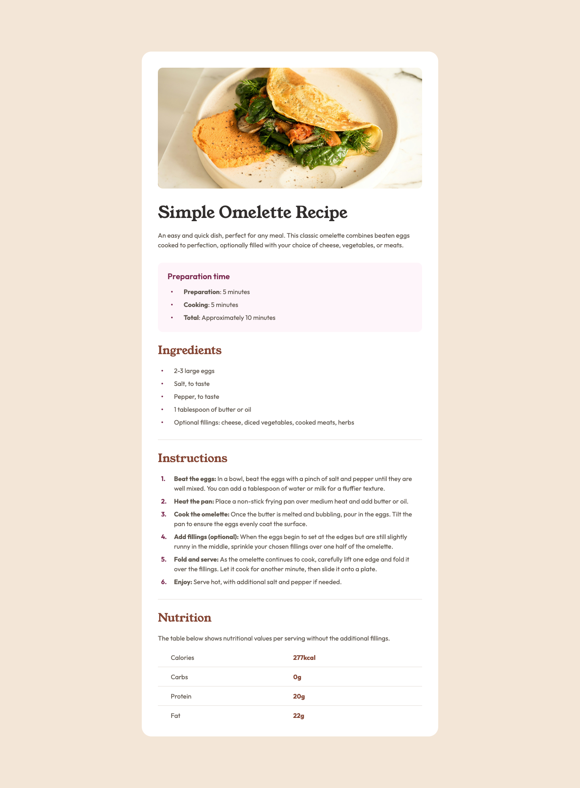

# Frontend Mentor - Recipe page solution

This is a solution to the [Recipe page challenge on Frontend Mentor](https://www.frontendmentor.io/challenges/recipe-page-KiTsR8QQKm). Frontend Mentor challenges help you improve your coding skills by building realistic projects. 

## Table of contents

- [Overview](#overview)
  - [The challenge](#the-challenge)
  - [Screenshot](#screenshot)
  - [Links](#links)
- [My process](#my-process)
  - [Built with](#built-with)
  - [What I learned](#what-i-learned)
  - [Continued development](#continued-development)
  - [Useful resources](#useful-resources)
- [Author](#author)

## Overview

### The challenge

The challenge is to build out this recipe page and get it looking as close to the proivded design as possible.

You can use any tools you like to help you complete the challenge. So if you've got something you'd like to practice, feel free to give it a go.

Ideas to test yourself:

- Do your research on various HTML elements and ensure you use the most appropriate element based on the content.
- Train your eye for detail by getting your solution to look similar to the design.

### Screenshot



### Links

- Solution/Live Site URL: [https://cocoelizabeth.github.io/frontendmentor-recipe-page/](https://cocoelizabeth.github.io/frontendmentor-recipe-page/)

## My process

### Built with

- Semantic HTML5 markup
- CSS custom properties
- Flexbox
- CSS Grid
- Mobile-first workflow

### What I learned

I learned how to create custom list styling for both ordered and unordered lists. I used CSS counters for the custom number styling. and I learned how to use CSS counters for creating custom. I created a reusable class for the custom lists custom list style based on the figma design that allowed and I learned about the css-
Use this section to recap over some of your major learnings while working through this project. Writing these out and providing code samples of areas you want to highlight is a great way to reinforce your own knowledge.


Since all of the bulleted lists and numbered lists in the design had similar spacing and layout, I was able to reuse the same `<li>` structure for each list item:

```html
<ul class="list custom-ul">
  <li class="text-preset-4 m-b-100">
    <span>List Item Text</span>
  </li>

  ...
  
</ul>
```
Then, I created a reusable
I created a reusable `.list` class that I applied to all of the lists (Preparation time, Ingredients, and Instructions).
```css
.list {
    margin: 0;
    padding: 0;
    width: 100%;

    li {
        display: flex;
        width: 100%;
    }

    li::before {
        font-weight: bold;
        color: var(--color-rose-800);
        height: 100%;
        min-width: var(--spacing-500);
        padding-left: 8px;
        padding-right: 8px;
        box-sizing: border-box;
    }
}
```

Then, for the unordered lists with bullet points, I 
First, I made a reusable `.list` class that could be applied to 

To see how you can add code snippets, see below:

```html
<h1>Some HTML code I'm proud of</h1>
```
```css
.proud-of-this-css {
  color: papayawhip;
}
```
```js
const proudOfThisFunc = () => {
  console.log('🎉')
}
```

If you want more help with writing markdown, we'd recommend checking out [The Markdown Guide](https://www.markdownguide.org/) to learn more.

**Note: Delete this note and the content within this section and replace with your own learnings.**

### Continued development

Use this section to outline areas that you want to continue focusing on in future projects. These could be concepts you're still not completely comfortable with or techniques you found useful that you want to refine and perfect.

**Note: Delete this note and the content within this section and replace with your own plans for continued development.**

### Useful resources

- [Example resource 1](https://www.example.com) - This helped me for XYZ reason. I really liked this pattern and will use it going forward.
- [Example resource 2](https://www.example.com) - This is an amazing article which helped me finally understand XYZ. I'd recommend it to anyone still learning this concept.

**Note: Delete this note and replace the list above with resources that helped you during the challenge. These could come in handy for anyone viewing your solution or for yourself when you look back on this project in the future.**

## Author

- Website - [Add your name here](https://www.your-site.com)
- Frontend Mentor - [@yourusername](https://www.frontendmentor.io/profile/yourusername)
- Twitter - [@yourusername](https://www.twitter.com/yourusername)

**Note: Delete this note and add/remove/edit lines above based on what links you'd like to share.**

## Acknowledgments

This is where you can give a hat tip to anyone who helped you out on this project. Perhaps you worked in a team or got some inspiration from someone else's solution. This is the perfect place to give them some credit.

**Note: Delete this note and edit this section's content as necessary. If you completed this challenge by yourself, feel free to delete this section entirely.**
